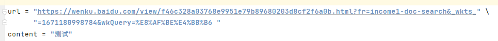
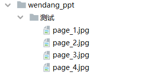

# 爬虫爬取百度文库资料

## 1 食用指南
### 1.1 爬取ppt
修改url为爬取ppt的链接  
修改content为爬取ppt的名称  

运行ppt.py文件，在wendang_ppt文件夹下便有下载的ppt图片  

## 2 遇到问题
### 2.1 问题一：etree包导入失败
**解决方法参考**：  
https://blog.csdn.net/qq_45516773/article/details/108549074

